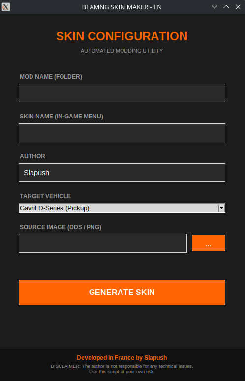

# 🚗 BeamNG Skin Toolbox


**BeamNG Skin Toolbox** est un outil d'automatisation puissant conçu pour les moddeurs de BeamNG.drive. Il élimine les erreurs manuelles fastidieuses en générant instantanément l'arborescence des dossiers, les fichiers JBeam et les fichiers de matériaux (`.cs`), tout en garantissant une compatibilité parfaite grâce à son système de nettoyage d'ID "Anti-Bug".

---

## 📸 Aperçus / Screenshots

### 🇫🇷 Version Française


### 🇬🇧 English Version


---

## ✨ Caractéristiques / Features

- **🛡️ Anti-Bug ID System**: Nettoie automatiquement les noms (suppression des apostrophes `'`, espaces et caractères spéciaux) pour éviter de corrompre les scripts du jeu.
- **🎨 BeamNG-Style UI**: Une interface moderne, sombre et épurée, inspirée directement des menus officiels du jeu.
- **⚡ Automated Workflow**: Crée la structure complète `vehicles/car_name/skin_id/` en un clic.
- **🖼️ Smart Texture Support**: Support natif du format `.dds` (copie directe) ou conversion automatique des fichiers `.png` via ImageMagick.
- **🧱 Legacy Material Logic**: Utilise le format `materials.cs` pour une stabilité maximale sur tous les modèles de véhicules.

---

## 🛠️ Installation

### 1. Prérequis / Prerequisites
- **Python 3.x**
- **ImageMagick** (Optionnel : requis uniquement pour convertir des images PNG en DDS).

### 2. Commandes par Système / System Commands

#### **🔵 CachyOS / Arch Linux**
```bash
sudo pacman -Syu python tk imagemagick
```

#### **🟠 Debian / Ubuntu / Linux Mint**
```bash
sudo apt update
sudo apt install python3 python3-tk imagemagick
```

#### **🔴 Fedora**
```bash
sudo dnf install python3 python3-tkinter ImageMagick
```

#### **🪟 Windows**
1. Installez **[Python](https://www.python.org/downloads/)** (Cochez "Add Python to PATH").
2. Installez **[ImageMagick](https://imagemagick.org/script/download.php#windows)**.
   * *⚠️ Lors de l'installation, cochez absolument "Install legacy utilities (e.g. convert)"*.

---

## 🚀 Utilisation / Usage

1. Exécutez le script correspondant à votre langue : 
#### **🇫🇷 Version Française**
Ouvrez votre terminal dans le dossier du script et tapez :
```bash
python beamng_skin_fr.py
```

#### **🇬🇧 English Version**
Open your terminal in the script folder and type:
```bash
python beamng_skin_en.py
```
> **Note (Linux)** : Si `python` ne fonctionne pas, essayez avec `python3`.

> **Note (Windows)** : Vous pouvez aussi simplement faire un **double-clic** sur le fichier `.py` si Python est correctement installé.

2. **Nom du Mod** : Le nom du dossier qui contiendra votre mod.
3. **Nom du Skin** : Le nom qui apparaîtra dans le menu de configuration du véhicule en jeu.
4. **Véhicule** : Sélectionnez le modèle cible dans la liste.
5. **Texture** : Sélectionnez votre fichier `.dds` ou `.png`.
6. Cliquez sur **GÉNÉRER**.
7. Récupérez votre dossier dans `OUTPUT_MODS` et placez-le dans :
   `Documents/BeamNG.drive/mods/unpacked/`

---

## ⚖️ Clause de non-responsabilité / Disclaimer

**FR :** L'auteur (Slapush) décline toute responsabilité en cas de problème technique, crash du jeu ou perte de données liés à l'utilisation de ce script. Utilisez cet outil à vos propres risques.

**EN :** The author (Slapush) is not responsible for any technical issues, game crashes, or data loss resulting from the use of this script. Use this tool at your own risk.

---

## 🏆 Crédits
- **Développé en France 🇫🇷 par Slapush.**
- Inspiré par l'univers et l'interface de **BeamNG.drive**.
